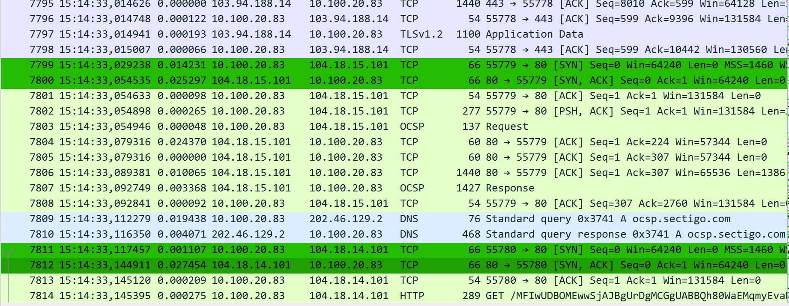
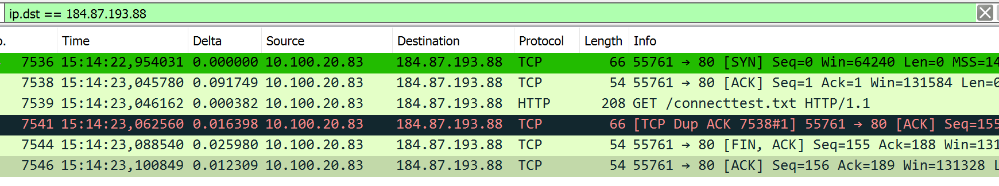
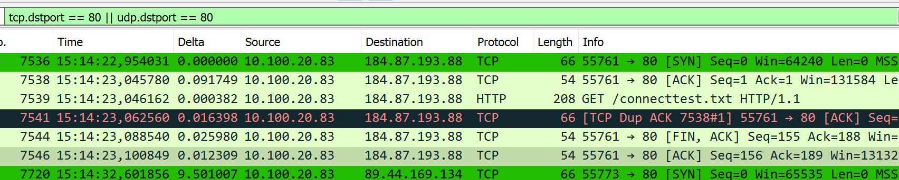
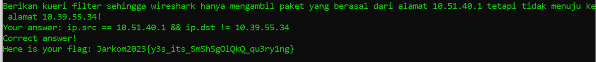

# Jarkom-Modul-1-D12-2023

## Anggota Kelompok

<table>
  <tr>
    <th>NRP</th>
    <th>Nama</th>
  </tr>
  <tr>
    <td>Muhammad Revel Wivanto</td>
    <td>5025211233</td>
  </tr>
  <tr>
    <td>Muhammad Choirun Ni'am</td>
    <td>5025221203</td>
  </tr>
</table>

 

### Analisis Packet Capture

## NO 1. **User melakukan berbagai aktivitas dengan menggunakan protokol FTP.**

   - Untuk memeriksa aktivitas dengan protokol FTP, pertama-tama, kita filter dengan menggunakan `"ftp"`. Ini akan menampilkan semua aktivitas FTP.
   - Selanjutnya, kita mencari file yang menonjol, seperti `"grabThePhisher.zip"`.
   - Kemudian, kita mencatat sequence number (raw) dan acknowledge number (raw).
   - Setelah itu, kita mencari file responsenya yang berada tepat di bawahnya dan mencatat sequence number (raw) dan acknowledge number (raw).
   
   
   

## NO 2. **Sebutkan web server yang digunakan pada portal praktikum Jaringan Komputer!**

   - Untuk mengidentifikasi web server yang digunakan dalam portal praktikum jarkom, kita menggunakan filter `"http"`.
   
   - Kita pilih entri paling atas dan melakukan follow tcp stream.
   - Hasilnya, dapat kita ketahui bahwa server portal praktikum jarkom menggunakan gunicorn.
   

## NO 3. **Dapin sedang belajar analisis jaringan. Bantulah Dapin untuk mengerjakan soal berikut:**
    
   - Dalam menjawab pertanyaan terkait paket dengan IP dan port tertentu, kita menggunakan display filtering yang sesuai.
   - Dalam contoh di bawah, terdapat 21 paket dengan protokol UDP.
    

## NO 4. **Berapa nilai checksum yang didapat dari header pada paket nomor 130?**

   - Untuk mengetahui header checksum pada paket nomor 130, kita periksa paket tersebut.
   - Hasilnya, checksumnya adalah `0x18e5`.
    

## NO 5. **Elshe menemukan suatu file packet capture yang menarik. Bantulah elshe untuk menganalisis file packet capture tersebut.**

   - Saat menganalisis file packet capture yang menarik, langkah-langkahnya adalah:
   - Mencoba membuka zip yang terkunci dengan mencari kunci.
   - Mengecek file tcp dan melakukan follow tcp stream.
   - Menemukan percakapan tentang password yang dienkripsi dalam base64.
   
   
   - Menggunakan base64 encoder online untuk menemukan kunci untuk membuka file zip.
   
   
   - Untuk mendapatkan port, kita bisa mengklik salah satu paket dengan protokol SMTP dengan port 25.
   - Kemudian, kita dapat melihat public IP dengan pola yang agak berbeda, yaitu `74.53.140.153`.
   

## NO 6. 
 *Seorang anak bernama Udin Berteman dengan SlameT yang merupakan seorang penggemar film detektif. sebagai teman yang baik, Ia selalu mengajak slamet untuk bermain valoranT bersama. suatu malam, terjadi sebuah hal yang tak terdUga. ketika udin mereka membuka game tersebut, laptop udin menunjukkan sebuah field text dan Sebuah kode Invalid bertuliskan "server SOURCE ADDRESS 7812 is invalid". ketika ditelusuri di google, hasil pencarian hanya menampilkan a1 e5 u21. jiwa detektif slamet pun bergejolak. bantulah udin dan slamet untuk menemukan solusi kode error tersebut.*

Untuk menyelesaikan soal ini, kita perlu memahami clue yang diberikan pada soal yakni "SOURCE ADDRESS 7812". Jadi kita mencurigai paket nomor 7812. Pertama kita pilih Go to Packet, kemudian masukkan 7812, lalu kita akan dibawa menuju paket 7812. Dari situ kita bisa melihat source addressnya yaitu 104.18.14.101.

Kemudian berdasarkan hint maka kita menggunakan substitusi a1z26 chiper, kemudian kita masukkan 10 4 18 14 10 1 dan saat di decode menunjukkan jdrnja. Karena dibatasi A-R yg merupakan huruf besar maka kita masukkan JDRNJA ke dalam ncat dan berhasil mendapatkan flag.

.png)

Kendala : Kita cukup kesulitan memahami maksud dan clue-clue yang diberikan soal pertama kali sehingga membutuhkan waktu yang cukup lama untuk menyelesaikan soal nomor 6.

## NO 7
*Berapa jumlah packet yang menuju IP 184.87.193.88?*

Untuk mengetahui jumlah packet yang menuju IP tersebut maka kita dapat melakukan display filter :
`ip.dst ==  184.87.193.88`

Dapat dilihat bahwa terdapat 6 paket.

## NO 8
*Berikan kueri filter sehingga wireshark hanya mengambil semua protokol paket yang menuju port 80! (Jika terdapat lebih dari 1 port, maka urutkan sesuai dengan abjad)!*

Untuk mengetahui paket yang menuju port 80 maka kita dapat meggunakan display filter :
`tcp.dstport == 80 || udp.dstport == 80`

.png)

## NO 9
*Berikan kueri filter sehingga wireshark hanya mengambil paket yang berasal dari alamat 10.51.40.1 tetapi tidak menuju ke alamat 10.39.55.34!*

Kita dapat menggunakan metode yang sama dengan nomor 8 yaitu melakukan display filter pada paket yang sudah tercapture yaitu dengan :
`ip.src == 10.51.40.1 && (ip.dst != 10.39.55.34)`

